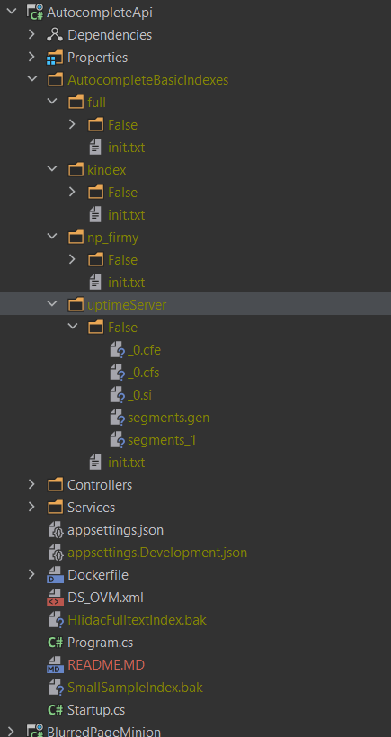

# Zprovoznění

1) V `Dockerfile` souboru je také tento řádek `COPY AutocompleteBasicIndexes/ /var/Autocomplete_App_Data/autocomplete`. 
   Složku **AutocompleteBasicIndexes** používám pro rychlý start - jsou zde uloženy indexy a dokumenty pro Lucene. Kvůli velikosti ji však nedávám do repository ale jde ji vygenerovat.
    - Stačí spustit (třeba lokálně) projekt s parametrem `gen`
    - `.\HlidacStatu.AutocompleteApi.exe gen` => Tím se vytvoří složka `AutocompleteBasicIndexes`, kterou je potřeba nakopírovat do rootu projektu
    - Struktura projektu vypadá nějak takto:

3) Když máme splněny předchozí body, pak stačí:
    - **publish** projektu v **release modu** do složky `./bin/dockerPublish/` 
    - a následně zavolat `docker build -t hlidacstatu/autocompleteapi:v2.1.2 .`
    - a potom `docker push hlidacstatu/autocompleteapi:v2.1.2`
